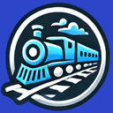
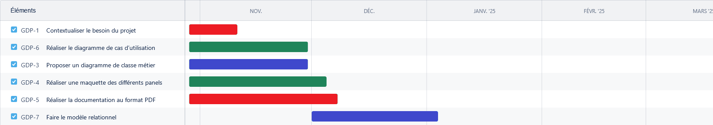
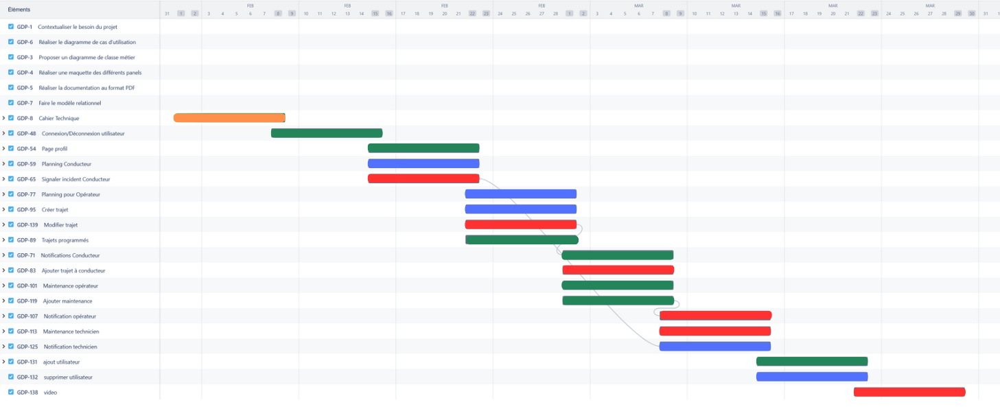
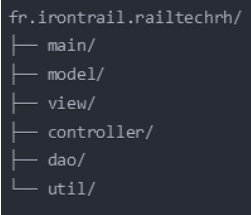

# RailTech-Solutions

AMRANI Malika, CASTILLO FOURNEL Itzel, OG Dylan, ESIEE-IT (BTS - SIO), 07/02/2025

---

## 1. Rappel bref du contexte

IronTrail, une grande entreprise nationale de transport ferroviaire, fait face à des défis majeurs en raison de la demande croissante pour ses services. Les principaux problèmes incluent la gestion des plannings des conducteurs, le suivi de la disponibilité des trains et la planification des trajets. Pour répondre à ces besoins, RailTech Solutions propose une solution innovante avec des fonctionnalités de gestion de plannings, de suivi des trains en temps réel et de gestion des trajets. Cette application vise à optimiser les opérations et améliorer la gestion quotidienne des ressources d'IronTrail.

---
## Diagramme Gantt

 
### Légende des couleurs : 
- 🟥 **Itzel CASTILLO FOURNEL**
- 🟩 **Malika AMRANI**
- 🟦 **Dylan OG**
- 🟧 Itzel, Malika et Dylan
## 2. Contraintes techniques

### 2.1 Outils et langages d'aides à la gestion de projet et à la conception de code

#### **Gestion du projet**
- **Git** : Gestion du contrôle de version
  - Version : `2.46.2.windows.1`
- **GitHub** (https://www.atlassian.com/software/jira) : Stockage du code, système de tickets pour le suivi des tâches
- **Jira** (https://www.atlassian.com/software/jira): Planification des tâches sous forme de diagramme de Gantt

#### **Conception**
- **Miro** (https://www.atlassian.com/software/jira) : Conception du diagramme de classe et des cas d'utilisation
- **MySQL** : Modélisation de la base de données
  - Version : `8.3.0`
- **Figma** (https://www.figma.com/fr-fr/) : Création des maquettes

### 2.2 Outils et langages contribuant directement à la solution

#### **Environnement de Développement**
- **IntelliJ IDEA** : IDE pour le développement
  - Version : `2024.2.3 Ultimate Edition`
- **SceneBuilder** : Conception des interfaces JavaFX
  - Version : `23.0.1`
- **Maven** : Gestion des dépendances
  - Version : `3.13.0`

#### **Frameworks et Bibliothèques**
- **Open JDK** : Langage principal de développement
  - Version : `JDK 23`
- **JavaFX 21** : Framework d'interface graphique
  - Version : `17.0.6`
- **JDBC MySQL Connector** : Connexion à la base de données
   - Version : `3.4.1`
- **JUnit** : Tests unitaires
  - Version : `5.10.2`

#### **Base de Données**
- **MySQL Server** : Système de gestion de base de données
   - Version : `8.0.41`
- **AlwaysData** (https://www.alwaysdata.com/fr/) : Interface d'administration de la base de données pour un accès distant

#### **Assistant IA**
- **DeepSeek** : Aide à la génération de jeux de données et assistance au développement
   - Version : `R1`
- **Claude-3** : Support pour la génération des données de test et l'optimisation du code
   - Version : `3.5`

## 4. Modèle relationnel

Utilisateur(id: int(10), nom: varchar(50), prenom: varchar(50), email: varchar(100), mdp: varchar(255), role: enum('ADMIN', 'TECHNICIEN', 'CONDUCTEUR', 'OPERATEUR'))
- Clé primaire : id
- Clé étrangère : .

---

Technicien(id: int(10), specialite: enum('MECANIQUE', 'ELECTRONIQUE', 'ELECTRIQUE', 'INFORMATIQUE', 'INFRASTRUCTURE'))
- Clé primaire : id
- Clé étrangère : id référence à Utilisateur.id

---

Train(immatriculation: varchar(50), marque: varchar(50), modele: varchar(50))
- Clé primaire : immatriculation
- Clé étrangère : .

---

Trajet(id: int(10), heureDepart: localdatetime, heureArrivee: localdatetime, arretDepart: enum('PARIS', 'LYON', 'MARSEILLE', 'BORDEAUX', 'TOULOUSE', 'LILLE', 'NANTES', 'STRASBOURG', 'NICE', 'RENNES', 'MONTPELLIER'), arretArrivee: enum('PARIS', 'LYON', 'MARSEILLE', 'BORDEAUX', 'TOULOUSE', 'LILLE', 'NANTES', 'STRASBOURG', 'NICE', 'RENNES', 'MONTPELLIER'), trainId: int(10), conducteurId: int(10))
- Clé primaire : id
- Clé étrangère : 
    - trainImmat référence à Train.immatriculation, 
    - conducteurId référence à Utilisateur.id

---

Incident(id: int(10), description: varchar(255), typeIncident: enum('PANNE_TECHNIQUE', 'RETARD_TRAIN','VOIE_ENDOMMAGEE', 'INCIDENT_A_BORD'), gravite: enum('MINEUR', 'MODERE', 'MAJEUR', 'CRITIQUE'), trainImmat: int(10))
- Clé primaire : id
- Clé étrangère : trainImmat référence à Train.immatriculation

---

Maintenance(dateMaintenance: localdatetime, description: varchar(255), etat: enum('PANNE','MAINTENANCE','OPERATIONNEL'), incidentId: int(10), technicienId: int(10))
- Clé primaire : .
- Clé étrangère : 
    - incidentId référence à Incident.id
    - technicienId référence à Utilisateur.id

## 5. Organisation du code

### **Structure générale des packages**

#### **Package `main`** (fr.irontrail.railtechrh.main)
- `App.java` : Classe principale initialisant l'application JavaFX

#### **Package `model`** (fr.irontrail.railtechrh.model)
- `UtilisateurModel.java`
- `ConducteurModel.java`
- `OperateurModel.java`
- `TechnicienModel.java`
- `TrainModel.java`
- `TrajetModel.java`
- `IncidentModel.java`
- `MaintenanceModel.java`
- `PlanningModel.java`
- `NotificationModel.java`
- `Role.java`
- `Arret.java`
- `Incident.java`
- `Gravite.java`
- `Specialite.java`
- `Etat.java`

#### **Package `view`** (fr.irontrail.railtechrh.view)
##### **Login**
- `LoginView.fxml`
##### **Dashboard**
- `ConducteurDashboard.fxml`
- `TechnicienDashboard.fxml`
- `OperateurDashboard.fxml`
- `AdminDashboard.fxml`
##### **Planning**
- `PlanningView.fxml`
##### **Maintenance**
- `MaintenanceList.fxml`
- `MaintenanceForm.fxml`
- `MaintenanceDetails.fxml`
##### **Incident**
- `IncidentList.fxml`
- `IncidentForm.fxml`
- `IncidentDetails.fxml`
##### **Trajet**
- `TrajetCreation.fxml`
- `TrajetList.fxml`
- `TrajetDetails.fxml`
##### **Common**
- `NotificationPanel.fxml`
- `Sidebar.fxml`
##### **CSS**
- `main.css`
- `login.css`
- `dashboard.css`
- `navigation.css`
- `forms.css`
- `planning.css`
- `tables.css`
- `components.css`

#### **Package `controller`** (fr.irontrail.railtechrh.controller)
- `LoginController.java`
- `DashboardController.java`
- `PlanningController.java`
- `MaintenanceController.java`
- `IncidentController.java`
- `TrajetController.java`
- `SidebarController.java`
- `MainController.java`
- `NotificationController.java`

#### **Package `dao`** (fr.irontrail.railtechrh.dao)
- `UtilisateurDAO.java`
- `TrainDAO.java`
- `TrajetDAO.java`
- `IncidentDAO.java`
- `MaintenanceDAO.java`
- `PlanningDAO.java`
- `DatabaseConnection.java`

#### **Package `util`** (fr.irontrail.railtechrh.util)
- Contient des classes utilitaires communes pour des fonctionnalités réutilisables

## 6. Extraction des données (Annexe)

_[Appli.sql](https://github.com/Itzel-castillo-fournel/RailTech-Solutions/blob/main/Appli.sql)_

