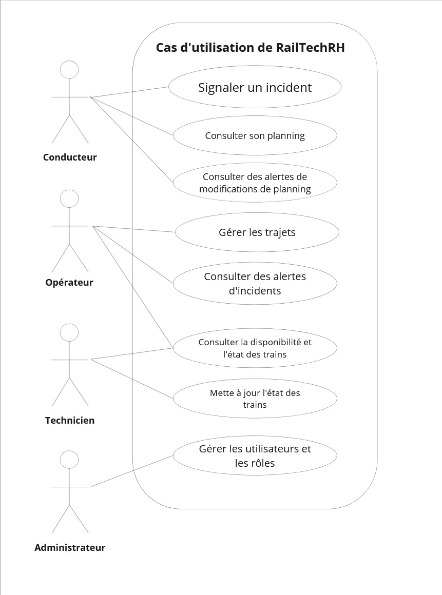
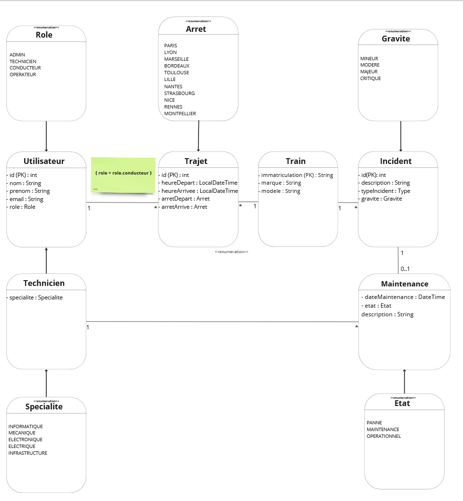

# 🚆 RailTech-Solutions

[Itzel CASTILLO FOURNEL, Malika AMRANI, Dylan OG](mailto:libitzel.castillo@gmail.com)  
ESIEE-IT (BTS - SIO)  
20/12/2024  

---

## 📋 Consignes

- 📌 **Constituer l'équipe** : 2 à 3 personnes  
- 📌 **Inventer un contexte** : Définir une organisation fictive travaillant dans le domaine ferroviaire, avec une problématique à résoudre.  
- 📌 **Solution proposée** :  
  - 3 fonctionnalités principales.  
  - Définir les utilisateurs de l'application.  
- 📌 **Créer un dépôt GitHub** dédié au projet.

---

## 🔒 Contraintes

- Application en **Client Lourd JavaFX** (fenêtrée).  
- Base de données accessible via Internet.  
- Développement en **Java**.  
- Gestion de **2 types d'utilisateurs minimum**.

---

## 💡 Aide

- Concevoir une **maquette d'interface utilisateur**.

---

# 🏢 Contexte : **IronTrail**

**IronTrail** est une grande entreprise nationale spécialisée dans le transport ferroviaire. Elle gère un réseau dense et complexe dans un pays où la demande pour les services ferroviaires est en constante augmentation.  
Avec une flotte importante de trains et de conducteurs, la gestion des opérations quotidiennes devient un défi majeur, nécessitant une solution innovante.

---

# ❓ Sa problématique

Avec l'augmentation constante de la demande pour le transport ferroviaire et la 
nécessité d'optimiser les opérations, IronTrail est confrontée à plusieurs défis majeurs :

### 🚦 **Gestion des plannings des conducteurs**
- Garantir la disponibilité des conducteurs tout en respectant les contraintes réglementaires (temps de conduite, repos obligatoire).  
- Une mauvaise gestion peut entraîner des retards et des conflits.  

### 🚂 **Suivi de la disponibilité des trains**
- Assurer un suivi en temps réel des trains selon leur état (maintenance, opérationnel, en panne).  
- Optimiser la disponibilité pour répondre à la demande croissante.  

### 🗺️ **Planification et gestion des trajets**
- Adapter rapidement les itinéraires en cas d'incidents sur le réseau.  
- Faciliter la création ou modification des trajets pour le personnel.

---

# ✅ La solution proposée : **RailTechRH**

Une application de bureau **innovante** et **intuitive** pour répondre aux besoins spécifiques d'IronTrail, avec trois fonctionnalités clés :  

### 📅 **Gestion des plannings des conducteurs**
- Affichage et modification des plannings.  
- Notifications pour les changements de dernière minute.  

### 🛠️ **Gestion des disponibilités des trains**
- Suivi en temps réel de l'état des trains.  
- Alertes pour la maintenance préventive ou les urgences.  

### 🚉 **Gestion des trajets**
- Création de nouveaux trajets.  
- Modification des trajets en fonction des conditions opérationnelles.

---

# 👤 Les utilisateurs

Le logiciel **RailTechRH** est conçu pour les profils suivants :  

- **Opérateurs :** Superviseurs des opérations ferroviaires (plannings, trajets, disponibilité des trains).  
- **Techniciens :** Responsables de la maintenance sur le réseau ferroviaire.  
- **Conducteurs :** Gestionnaires de leurs propres plannings et trajets assignés.  
- **Administrateurs :** Gestion des rôles et accès utilisateurs.

---

# 📊 Diagrammes

### 🖼️ **Diagramme de cas d'utilisation**

### 📘 **Diagramme de classes**

### 📄 **Maquette de l'application (PDF)**
